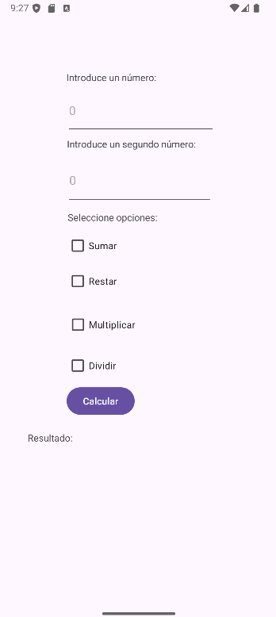
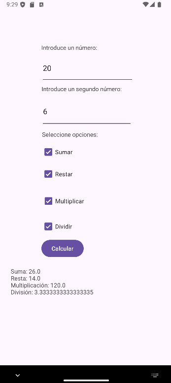

# Calculadora con Checkboxes 📱 ➗ ✖️ ➕ ➖

Este es un proyecto realizado en **Android Studio** para la materia de **Programación Multimedia** en la escuela **Digitech**. La aplicación es una **calculadora** que permite realizar operaciones matemáticas básicas (suma, resta, multiplicación y división) sobre dos números proporcionados por el usuario. Las operaciones se seleccionan mediante **Checkboxes** y los resultados de las operaciones seleccionadas se muestran al presionar el botón "Calcular".

---

## 🚀 Características
- **Entrada de números:** Permite ingresar dos números.
- **Operaciones seleccionables:** El usuario puede elegir entre suma, resta, multiplicación y división.
- **Resultados múltiples:** Muestra el resultado de todas las operaciones seleccionadas.
- **Interfaz sencilla y amigable.**

---

## 📦 Instalación

Para usar este proyecto en tu dispositivo, sigue estos pasos:

### Requisitos
- **Android Studio** instalado en tu computadora.
- Un **dispositivo Android** o un **emulador de Android** para ejecutar la aplicación.

### Pasos de instalación
1. **Clona el repositorio** (si es necesario):
   ```bash
   git clone https://github.com/usuario/proyecto-calculadora.git
## 🔧 Pasos para Ejecutar el Proyecto

### 1. Abre el proyecto en Android Studio:
- Abre **Android Studio** y selecciona "Abrir proyecto".
- Navega hasta la carpeta donde clonaste o guardaste el proyecto y selecciona la carpeta del proyecto.

### 2. Conecta tu dispositivo:
- Habilita la **Depuración USB** en tu dispositivo Android (Ajustes > Opciones de desarrollador).
- Conecta el dispositivo mediante un cable USB.

### 3. Ejecuta la aplicación:
- Presiona el botón de "Ejecutar" en Android Studio (ícono de triángulo verde).
- Selecciona tu dispositivo o emulador para iniciar la aplicación.

---

## 📱 Modo de Uso

### 1. Introduce los números:
En los campos de texto, introduce los dos números sobre los cuales deseas realizar las operaciones.

### 2. Selecciona las operaciones:
Marca los **Checkboxes** correspondientes a las operaciones que deseas realizar:
- **Suma**: Para sumar los dos números.
- **Resta**: Para restar el segundo número del primero.
- **Multiplicación**: Para multiplicar los dos números.
- **División**: Para dividir el primer número entre el segundo (si el segundo número no es cero).

### 3. Presiona "Calcular":
Al presionar el botón "Calcular", la aplicación calculará y mostrará los resultados de las operaciones seleccionadas.

### 4. Resultados:
Los resultados de las operaciones seleccionadas aparecerán debajo del botón, indicando los valores obtenidos para cada operación.

---

## ⚙️ Tecnologías Utilizadas
- **Android Studio**: IDE utilizado para el desarrollo de la aplicación.
- **Java/Kotlin**: Lenguaje de programación utilizado para el desarrollo de la lógica de la aplicación.
- **XML**: Para diseñar la interfaz de usuario (UI).
- **Android SDK**: Para las funcionalidades específicas del sistema operativo Android.

---

## 👀 Capturas de Pantalla




